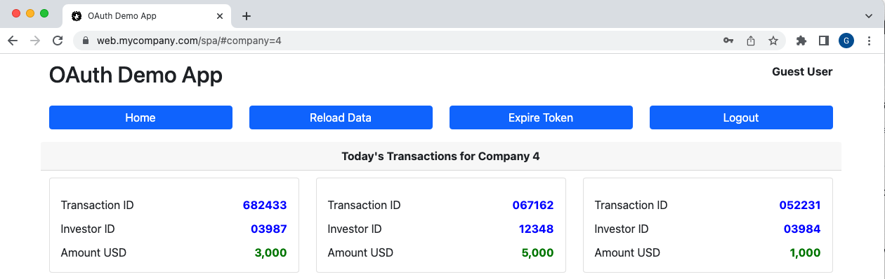

# OAuth Azure AD SPA and API Code Sample

[](https://www.codacy.com/gh/gary-archer/oauth.websample2/dashboard?utm_source=github.com&amp;utm_medium=referral&amp;utm_content=gary-archer/oauth.websample2&amp;utm_campaign=Badge_Grade)

[](https://snyk.io/test/github/gary-archer/oauth.websample2?targetFile=spa/package.json)

[](https://snyk.io/test/github/gary-archer/oauth.websample2?targetFile=api/package.json)

## Overview

A sample focused on intergating with Azure Active Directory using a standards based approach:

- The SPA uses the traditional OpenID connect flow, with session management features
- The API uses extensible claims for authorization

## Views

The SPA is a simple UI with some basic navigation between views, to render fictional resources.\
The data is returned from an API that authorizes using domain specific claims.



## Prerequisites

See the [Azure Overview](https://authguidance.com/2017/11/30/azure-active-directory-setup/) for details on the initial setup and SPA + API registration.\
Then update the settings in these files to point to your own Azure AD instance and application instances:

- spa/spa.config.json
- api/api.config.json

## Local Development Quick Start

Ensure that Node.js is installed, then run the following script from a macOS terminal or from Git Bash on Windows:

```bash
./build.sh
```

Custom development domains are used so you must add these entries to your hosts file:

```
127.0.0.1 localhost web.mycompany.com api.mycompany.com
```

Trust the root certificate that the build step downloads to your computer, in order for SSL to work in the browser.\
Add this file to the system keychain on macOS or the Windows certificate trust store for the local computer:

```
./api/certs/localhost/mycompany.com.ca.pem
```

Then run the following script to run the code for both SPA and API:

```bash
./deploy.sh
```

A browser will then be invoked, after which you can sign in with your own Azure AD test user accounts.

## Further Information

* See the [Azure SPA Troubleshooting](https://authguidance.com/2017/12/01/azure-ad-spa-code-sample/) page to understand some vendor specific behaviour

##  2021 Security Update

- In 2021 it is instead recommended to keep tokens out of the browser, using a Backend for Frontend
- See the [Final SPA Code Sample](https://github.com/gary-archer/oauth.websample.final) for an API driven implementation

## Programming Languages

* Typescript is used, to develop the SPA in the simplest way
* Node.js and TypeScript are used to implement the API

## Infrastructure

* Express is used to host both the API and the SPA content
* Azure Active Directory is used as the default Authorization Server
* The [oidc-client library](https://github.com/IdentityModel/oidc-client-js) is used by the SPA to implement OpenID Connect
* The [JOSE library](https://github.com/panva/jose) is used by the API to validate JWT access tokens
* The [Node cache](https://github.com/mpneuried/nodecache) is used to cache API custom claims against received tokens
