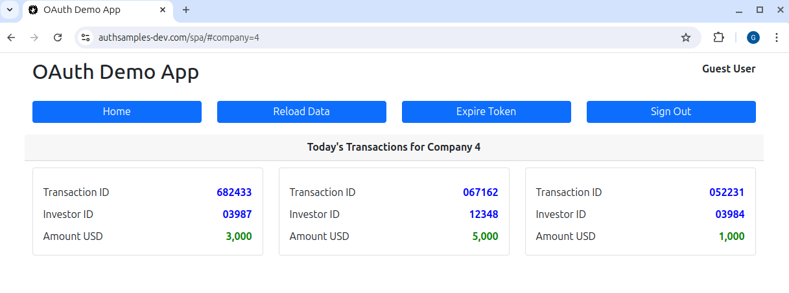

# Entra ID SPA and API Code Sample

[](https://app.codacy.com/gh/gary-archer/oauth.websample.azure?utm_source=github.com&utm_medium=referral&utm_content=gary-archer/oauth.websample.azure&utm_campaign=Badge_Grade)

[](https://snyk.io/test/github/gary-archer/oauth.websample.azure?targetFile=spa/package.json)
[](https://snyk.io/test/github/gary-archer/oauth.websample.azure?targetFile=api/package.json)

## Overview

An OAuth code sample that adapts the [updated SPA and API code sample](https://github.com/gary-archer/oauth.websample1) to use Microsoft Entra ID.\
The goal is to demonstrate code portability, where these features work the same regardless of the authorization server:

- The SPA uses the traditional OpenID connect flow, with session management features.
- The API combines claims-based authorization with finer-grained business permissions.
- The SPA and API use both OAuth user attributes and business user attributes.

## Views

The SPA is a simple UI with some basic navigation between views, to render fictional investment resources.



## Prerequisites

See the [Entra ID SPA and API Setup](https://apisandclients.com/posts/azure-active-directory-setup) for the Microsoft online configuration details.\
You could configure all of the settings and then update these configuration files to point to your own Entra ID tenant:

- spa/spa.config.json
- api/api.config.json

## Local Development Quick Start

Ensure that Node.js 20+ is installed, then run the build script:

```bash
./build.sh
```

You must use custom development domains and add these DNS entries to your hosts file:

```
127.0.0.1 localhost www.authsamples-dev.com api.authsamples-dev.com
```

Next configure [Browser SSL Trust](https://apisandclients.com/posts/developer-ssl-setup) for the SSL root certificate:

```
./api/certs/localhost/authsamples-dev.com.ca.crt
```

Then run the following script to run the code for both SPA and API:

```bash
./run.sh
```

The system browser runs and you can sign in with your own Entra ID user accounts.

## Further Information

* See the [Entra ID SPA and API OAuth Flow](https://apisandclients.com/posts/azure-ad-troubleshooting) page to understand some finer details.

## 2021 Security Update

$\color{red}{\textsf{The initial SPA uses OAuth tokens in JavaScript code, as the simplest way to get integrated.}}$\
$\color{red}{\textsf{In 2021 it is instead recommended to keep tokens out of the browser to limit the impact of XSS exploits.}}$\
See the [Final SPA Code Sample](https://github.com/gary-archer/oauth.websample.final) for a more secure implementation.

## Programming Languages

* The SPA and its views use plain TypeScript code.
* The API uses Node.js and TypeScript.

## Infrastructure

* Express is used as the HTTP server for both the API and the SPA's web static content.
* The SPA uses the [oidc-client-ts](https://github.com/authts/oidc-client-ts) library to implement OpenID Connect.
* The API uses the [jose](https://github.com/panva/jose) library to validate JWT access tokens.
* Microsoft Entra ID is the default authorization server for the SPA and API.
