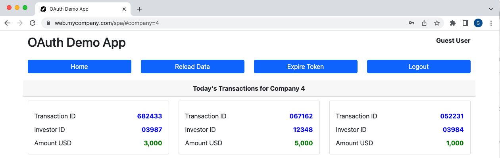

# Entra ID SPA and API Code Sample

[](https://app.codacy.com/gh/gary-archer/oauth.websample.azure?utm_source=github.com&utm_medium=referral&utm_content=gary-archer/oauth.websample.azure&utm_campaign=Badge_Grade)

[](https://snyk.io/test/github/gary-archer/oauth.websample.azure?targetFile=spa/package.json)
[](https://snyk.io/test/github/gary-archer/oauth.websample.azure?targetFile=api/package.json)

## Overview

An OAuth sample focused on integrating with Microsoft Entra ID using a standards based approach:

- The SPA uses the traditional OpenID connect flow, with session management features
- The API authorizes access to data using claims from multiple data sources

## Views

The SPA is a simple UI with some basic navigation between views, to render fictional resources.\
The data is returned from an API that authorizes using claims from multiple sources.



## Prerequisites

See the [Entra ID SPA and API Setup](https://apisandclients.com/posts/azure-active-directory-setup) for the Microsoft online configuration details.\
Then update the settings in these files to point to your own Entra ID tenant:

- spa/spa.config.json
- api/api.config.json

## Local Development Quick Start

Ensure that Node.js 20+ is installed, then run the build script:

```bash
./build.sh
```

Custom development domains are used so you must add these entries to your hosts file:

```
127.0.0.1 localhost www.authsamples-dev.com api.authsamples-dev.com
```

Next configure [Browser SSL Trust](https://apisandclients.com/posts/developer-ssl-setup) for the SSL root certificate:

```
./api/certs/localhost/authsamples-dev.com.ca.crt
```

Then run the following script to run the code for both SPA and API:

```bash
./run.sh
```

A browser will then be invoked, after which you can sign in with your own Entra ID test user accounts.

## Further Information

* See the [Entra ID SPA and API OAuth Flow](https://apisandclients.com/posts/azure-ad-troubleshooting) page to understand some finer details

## 2021 Security Update

- In 2021 it is instead recommended to keep tokens out of the browser, using a Backend for Frontend
- See the [Final SPA Code Sample](https://github.com/gary-archer/oauth.websample.final) for an API driven implementation

## Programming Languages

* Plain TypeScript is used for the SPA, to explain OAuth behaviour in the simplest way
* Node.js and TypeScript are used to implement the API

## Infrastructure

* Express is used to host both the API and the SPA content
* Microsoft Entra ID is used as the default Authorization Server
* The [oidc-client-ts](https://github.com/authts/oidc-client-ts) library is used by the SPA to implement OpenID Connect
* The [jose](https://github.com/panva/jose) library is used by the API to validate JWT access tokens
* The [node-cache](https://github.com/mpneuried/nodecache) library is used to cache extra claims, when access tokens are first received
